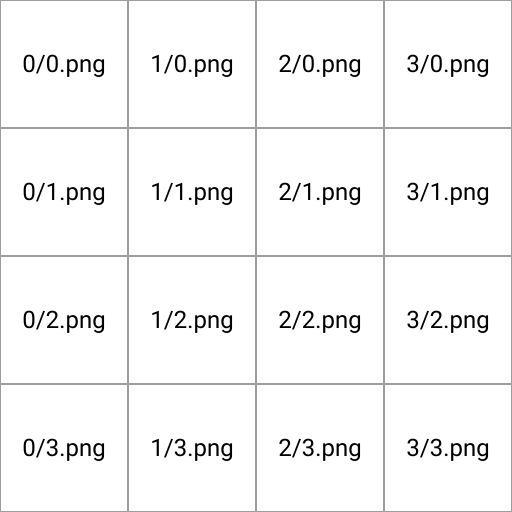

# Output

## 1. Introduction
This specification outlines the structure of the output directory of a single map.

## 2. Overview

## 3. `geojson/` directory
The `geojson/` directory holds the vector data of all buildings and locations as multiple [geojson files](https://en.wikipedia.org/wiki/GeoJSON). Each file is gzipped and holds an array of [geojson features](https://tools.ietf.org/html/rfc7946#section-3.2).  

### 3.1 `geojson/House.geojson.gz`
Includes an array of all houses. Each house has a geometry of [type polygon](https://tools.ietf.org/html/rfc7946#section-3.1.6). The `properties` field includes a 

## 4. `meta.json`
The `meta.json` includes all important meta data of the map. The format of this file is further specified [here](./metajson_spec.md).  

## 5. `sat/` directory
The `sat/` directory includes the satellite image. Because the full image can easily get over 100MB in size (and large files are always a pain in the ass to handle) it is always split in 16 tiles.  

Each tile within the `sat/` directory has the following nomenclature `{col}/{row}.png` with `{col}` being the column number and `{row}` the row number of the tile. Row/column numbers start at 0 and the origin is in the top left corner of the sat-image. So the image `sat/0/0.png` is the most top left tile of the satellite image.   

The following image explains this better than anything written ever could:  
  
  
## 6. `dem.asc.gz`
The `dem.asc.gz` includes the [Digital Elevation Model](https://en.wikipedia.org/wiki/Digital_elevation_model) of the map. The file is gzipped and in the [ESRI ASCII Raster Format](https://desktop.arcgis.com/de/arcmap/10.3/manage-data/raster-and-images/esri-ascii-raster-format.htm). 

## 7. `preview.png`
The `preview.png` is the maps preview image (image shown in the in-game map selection screen of the editor).
